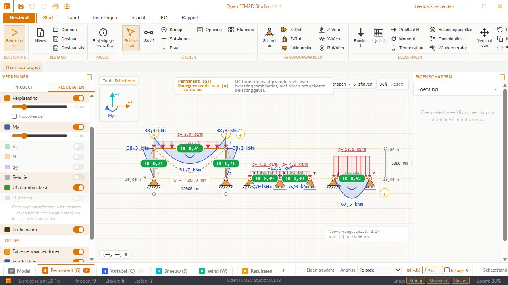
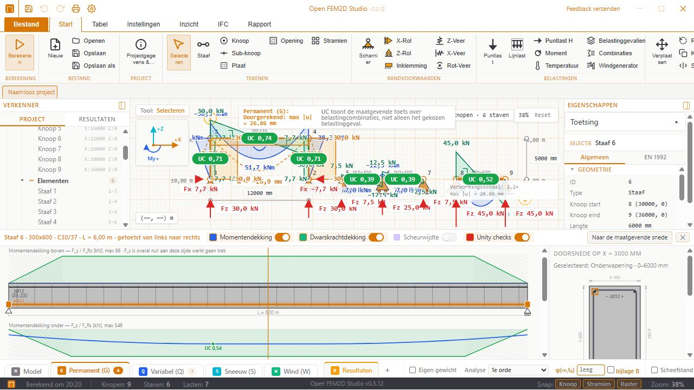
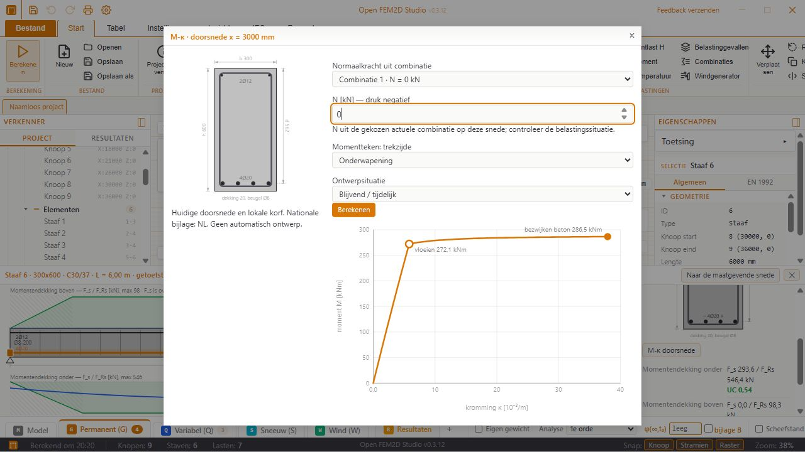
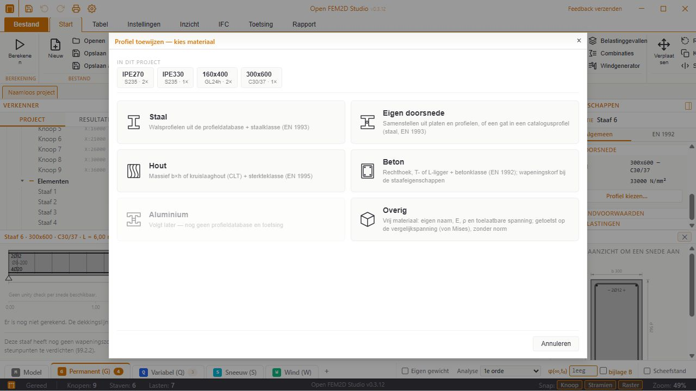
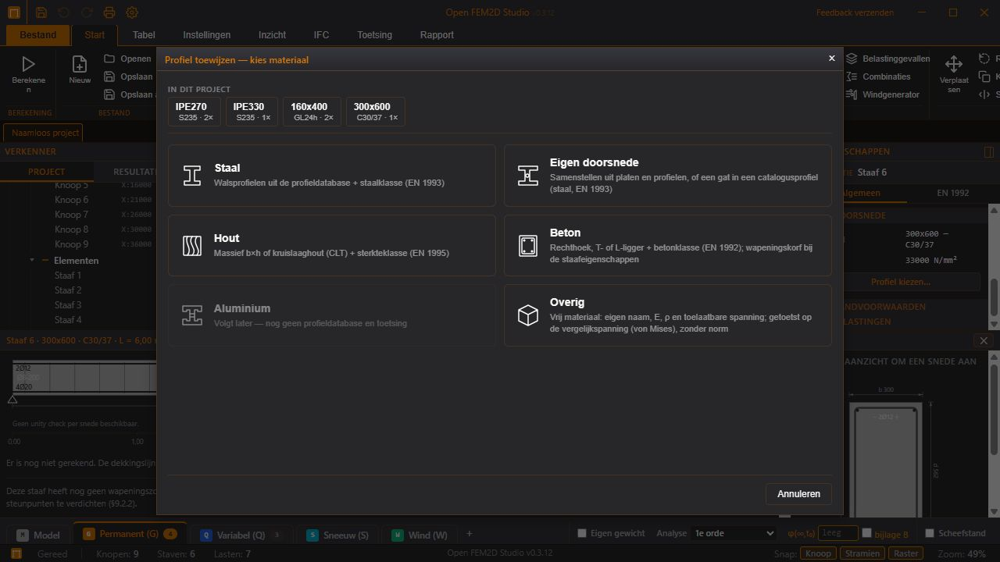
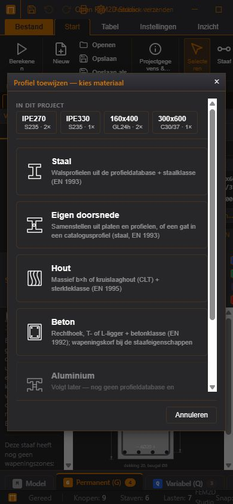

<p align="center">
  <strong>Open FEM2D Studio</strong>
</p>

<p align="center">
  Open-source 2D-eindige-elementenprogramma voor constructieve berekeningen en normtoetsing.<br>
  Onderdeel van het portfolio van de <a href="https://github.com/OpenAEC-Foundation">OpenAEC Foundation</a>.
</p>

<p align="center">
  <a href="LICENSE.md"></a>
  
</p>

---

## Wat het programma doet

- Staven en platen (wandschijven, belast in het vlak) in 2D: lineair, tweede orde en fysisch niet-lineair
- Belastinggevallen, belastingcombinaties en omhullenden
- Normtoetsing per staaf: staal (NEN-EN 1993-1-1, langslassen NEN-EN 1993-1-8), hout en kruislaaghout
  (NEN-EN 1995-1-1), gewapend beton (NEN-EN 1992-1-1), plus een vrije spanningstoets
- Toetsing van platen per element
- Rekenrapport als PDF
- IFC-export; projectbestanden met de extensie `.ifcfem2d`
- Gebruikersinterface in het Nederlands, Engels, Duits en Frans

## Schermafbeeldingen

Model met krachtsverloop en vervormingen:



Betonmodule met wapening en momentendekking:



M-κ-diagram van de geselecteerde doorsnede met lokale wapening en gekozen normaalkracht:



De materiaalkiezer gebruikt dezelfde iconen in het lichte en donkere thema
en past zich aan een smal venster aan.

<details>
<summary>Materiaalkiezer: licht, donker en smal</summary>







</details>

## Opbouw van de repository

| Map | Inhoud |
|-----|--------|
| `design-mockup/` | **Het programma (v2).** React 19 + TypeScript + Vite 7, zustand, i18next. De mapnaam is historisch: dit is de app die gebouwd en uitgebracht wordt. |
| `design-mockup/src/core/` | De FEM-kern: `fem/` (Mesh, staaf-, driehoeks-, vierhoeks- en DKT-elementen, plaatmesher), `solver/` (Assembler, NonlinearSolver), `math/`, `mesher/` |
| `design-mockup/src/components/fem/solver/engine.ts` | Adapter tussen de UI-gegevens en de kern (eenheden, tekens); bevat geen FEM-wiskunde |
| `src-tauri/` | Tauri v2-desktopschil (`src/lib.rs` met de Tauri-commando's) en de Rust-workspace |
| `src-tauri/crates/` | De Rust-rekenkernen (zie hieronder) |
| `src/` | De eerste versie van de app (v1). Bevroren: `tauri.conf.json` en de release-workflow bouwen hem niet meer. Nieuw werk hoort in `design-mockup/`. |
| `docs/`, `voorbeelden/` | Documentatie en voorbeeldprojecten |

### Rust-crates in `src-tauri/crates/`

| Crate | Rol |
|-------|-----|
| `mechanics` | Basisstructuren: krachten, momenten, staafas, omhullenden |
| `nationale-bijlage` | De normnaad: welke nationale bijlage geldt en welke nationaal bepaalde parameters daarbij horen |
| `nen-en-1990` | Partiële factoren, ψ-factoren en gevolgklassen (NEN-EN 1990 + NB) |
| `section-properties` | Doorsnedegrootheden uit geometrie; bevat ook de binary `doorsnedemotor` |
| `steel-profiles` | Staalprofieldatabase (`data/profiles.json`), bron voor de gegenereerde TypeScript-tabellen |
| `nen-en-1993-1-1-section` | Doorsnedetoetsen staal (art. 6.2) |
| `nen-en-1993-1-1-stability` | Stabiliteitstoetsen staal (§6.3) |
| `nen-en-1993-1-1-ltb` | Kip (§6.3.2) met Mcr volgens de nationale bijlage |
| `nen-en-1993-1-8-las` | Doorlopende langslas in een samengestelde doorsnede |
| `steel-check` | Orkestratie van de staaltoetsing per staaf |
| `nen-en-1995-1-1` | Rekenregels hout en kruislaaghout |
| `timber-check` | Orkestratie van de houttoetsing per staaf |
| `nen-en-1992-1-1` | Beton: materiaal, spanning-rekrelaties, M-N-κ-doorsnedeberekening |
| `concrete-check` | Orkestratie van de betontoetsing per staaf |
| `plaat-check` | Toetsing van platen per element |
| `spanning-check` | Vrije spanningstoets (von Mises tegen een toelaatbare spanning) |
| `openaec-layout` | PDF-opmaakengine |
| `report` | Het PDF-rekenrapport, gebouwd op `openaec-layout` |
| `toetsbrug` | Normtoetsing als JSON-in/JSON-uit (stdin/stdout) |
| `openaec-mcp-server` | MCP-server (JSON-RPC over stdio) voor de toetskernen, de solver en de bediening van de app |

## Drie wegen naar de rekenkern

Elke rekenkern moet langs drie wegen bereikbaar zijn; de rekengang zelf staat in de bibliotheek van de crate.

1. **Tauri-commando** in `src-tauri/src/lib.rs` (geregistreerd in `generate_handler!`) — de geïnstalleerde desktop-app.
2. **Toetsbrug** (`crates/toetsbrug`) — de Vite-devserver roept `target/release/toetsbrug` aan via `POST /api/toetsing`, zodat de toetsing ook in de browser werkt. Doorsnedegrootheden lopen op dezelfde manier via `doorsnedemotor` en `POST /api/doorsnede`.
3. **MCP-server** (`crates/openaec-mcp-server`) — de TypeScript-solver draait daar als gebundelde sidecar
   (`assets/fem-kernel.mjs`, gecontroleerd met een SHA-256 in `build.rs`) in een kortlevend Node-proces.

`crates/openaec-mcp-server/tests/drie_wegen_kruistabel.rs` bewaakt dat de wegen overeenkomen.

## Bouwen

Vereisten: Node.js (de CI gebruikt 22), de Rust-toolchain via [rustup](https://rustup.rs/), en op Windows de WebView2-runtime.

```bash
npm install                                  # root: Tauri-CLI
npm --prefix design-mockup install           # de frontend

# vanuit de root:
npm run tauri:dev     # desktop-app in ontwikkelstand (devserver op poort 1440)
npm run tauri:build   # installer; bouwt de frontend in design-mockup/ zelf
```

Voor de browserstand en de testbatterij zijn de release-binaries nodig:

```bash
cd src-tauri
cargo build --release -p toetsbrug -p openaec-mcp-server
cargo build --release -p section-properties --bin doorsnedemotor
```

Na een wijziging aan de solverkern of de adapter: de sidecarbundel opnieuw bouwen met
`npm run build:sidecar` in `design-mockup/`.

### Windows-toolchain

Het project bouwt op `x86_64-pc-windows-gnu` (MinGW) en `x86_64-pc-windows-msvc` (Visual Studio Build Tools).
De app-crate is bewust alleen `lib` (geen `cdylib`), omdat een DLL met alle overgeërfde symbolen de exportlimiet
van 64K van PE/COFF overschrijdt. Voor volledige debug-builds kun je naar MSVC overstappen:

```bash
rustup default stable-x86_64-pc-windows-msvc
```

## Testen

```bash
cd design-mockup
npx tsc --noEmit
node scripts/run-tests.mjs            # alle test-*.mjs tegen de bron
node scripts/run-tests.mjs --bundel   # de adaptertests tegen de sidecarbundel

cd ../src-tauri
cargo test --workspace --exclude open-fem2d-studio
```

Een deel van de `test-*.mjs`-batterij roept `toetsbrug` en `openaec-mcp-server` uit `src-tauri/target/release/` aan;
bouw die eerst, anders test je een oude kern. Nieuwe tests horen geregistreerd te worden in
`design-mockup/scripts/run-tests.mjs` (`BUNDEL_TESTS` of `ALLEEN_BRON`).

## Release

Het versienummer staat in `src-tauri/tauri.conf.json`, `src-tauri/Cargo.toml` (en daarmee `Cargo.lock`) en
`design-mockup/package.json`. Een tag `v*` start `.github/workflows/release.yml`, die de installers bouwt en een
conceptrelease publiceert. De root-`package.json` levert alleen de Tauri-CLI en de v1-scripts; zijn versienummer
hoort niet bij deze reeks.

## Licentie

CC BY-SA 4.0 — zie [LICENSE.md](LICENSE.md)

## Over de OpenAEC Foundation

De OpenAEC Foundation ontwikkelt vrije, open-source software voor de gebouwde omgeving.
Build free. Build together. — [openaec.org](https://github.com/OpenAEC-Foundation)
